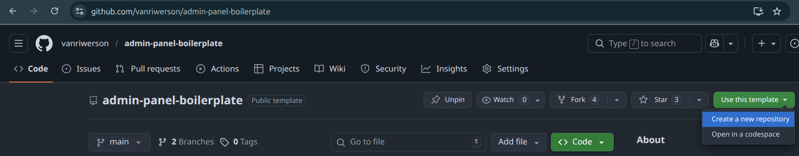
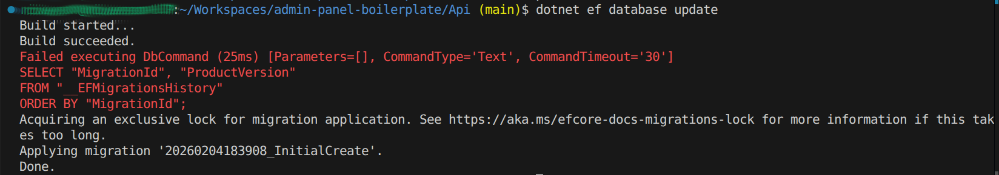
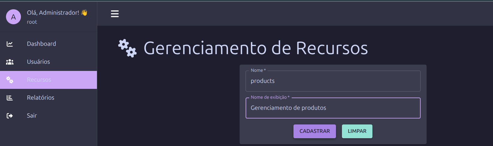

# Guia de Desenvolvimento (Criação de novos projetos a partir deste template.)

## Instalações Necessárias

Antes de começar a trabalhar neste projeto, certifique-se de ter instaladas as ferramentas abaixo (ou equivalentes) no seu ambiente:

- **.NET SDK** (recomendado: 8.x) - necessário para compilar e rodar o backend.

  ```bash
    # Exemplo (Ubuntu):
    sudo apt update && sudo apt install -y dotnet-sdk-8.0
    # Windows/Mac: baixe em https://dotnet.microsoft.com/download
  ```

- **Node.js** (recomendado: 18.x ou superior) - necessário para rodar o frontend.

  ```bash
    # Exemplo (nvm):
    nvm install 18
    nvm use 18
    # Alternativamente: https://nodejs.org/
  ```

- **Docker** (opcional, mas recomendado) - usado para rodar o banco de dados e outros serviços em containers.

  ```bash
    # Exemplo (Ubuntu):
    sudo apt update && sudo apt install -y docker.io
    # Verifique com: docker --version
  ```

- **Docker Compose** (pode vir incluso com Docker Desktop / Docker Engine como `docker compose`) - usado para orquestrar os serviços usados pelo template.

  ```bash
    # Verifique instalação:
    docker compose version
    # Se necessário (Ubuntu):
    sudo apt install -y docker-compose
  ```

- **dotnet-ef** (Entity Framework CLI) - para executar migrations e gerenciar o banco de dados:
  ```bash
    dotnet tool install --global dotnet-ef
    dotnet ef --version
  ```

### Ferramentas Recomendadas

_[Visual Studio Code](https://code.visualstudio.com/) com as extensões:_

**Backend (.NET):**

- C# (Microsoft)
- C# Dev Kit
- NuGet Package Manager
- Database Client

**Frontend (React):**

- ESLint
- Prettier
- ES7+ React/Redux/React-Native snippets
- Auto Rename Tag

**Banco de Dados (Caso não queira utilizar o Docker):**

- [pgAdmin](https://www.pgadmin.org/) - GUI para PostgreSQL
- [DBeaver](https://dbeaver.io/) - Alternativa universal

**Cliente REST para testes da API:**

- [Postman](https://www.postman.com/)
- [Bruno](https://www.usebruno.com/)
- [Insomnia](https://insomnia.rest/)
- REST Client (extensão VS Code)

### Configuração do Ambiente

1. **Inicie um novo projeto a partir do template**

- No github, na página desse [repositório](https://github.com/vanriwerson/admin-panel-boilerplate), clique em:

`Use this template` e depois em `Create a new repository`.



- Após configurar o novo repositório (setar o owner, nome do repo, etc...) e clicar em `Create repository`, clone o novo repositório e navegue para ele

```bash
  git clone https://github.com/vanriwerson/novo-repo-criado
  cd novo-repo-criado/
```

2. **Configure variáveis de ambiente**

_Crie arquivos .env para Api e WebApp a partir dos exemplos:_

```bash
  cp Api/.env.example Api/.env
  cp WebApp/.env.example WebApp/.env
```

Edite os arquivos, adequando portas conforme necessário.

**Api/.env:**

```bash
  # Database connection
  DB_HOST=localhost
  DB_PORT=5432
  DB_USER=postgres
  DB_PASSWORD=postgres
  DB_NAME=admin_panel_db

  # Rodar serviço db utilizando Docker
  POSTGRES_USER=postgres
  POSTGRES_PASSWORD=postgres
  POSTGRES_DB=admin_panel_db

  # Roda seed de usuários para desenvolvimento. Setar como false em produção
  RUN_USERS_SEED=true

  # Application
  API_PORT=5209

  # JWT
  JWT_SECRET_KEY=XvwKtOBmcu74xUwf8iaTLhb+JNCq1F73jUkbkuNHG+U=

  # CORS
  WEB_APP_URL=http://localhost:5173

  # Redefinição de senha via e-mail
  RESEND_API_KEY=re_ChaveDeApiDoServicoResend
  RESEND_FROM_EMAIL=emailCadastradoNoResend
```

**WebApp/.env:**

```bash
  VITE_API_BASE_URL=http://localhost:API_PORT/api
```

3. **Configure o Banco de Dados**

_Após as adequações necessárias nos arquivos .env:_

- Suba o serviço (container) do banco de dados:

```bash
  docker compose -f docker-compose.development.yml up db
```

_Se todas as configurações feitas estiverem corretas, voce verá um log com a mensagem: `database system is ready to accept connections`_

- Navegue até a pasta do backend da aplicação:

```bash
  cd Api/
```

- Rode a Migration base da aplicação:

```bash
  dotnet ef database update
```

_Você verá algo como:_



_O Erro que aparece é normal, pois não temos `__EFMigrationsHistory` nesse momento. O importante para nós é o `Done` ao final. Isso garante que todas as tabelas da migration InitialCreate foram criadas corretamente pelo EF e já temos toda a estrutura necessária para rodar a api._

4. **Instale as dependências do Backend e inicialize a api**

```bash
  dotnet restore
  dotnet ef database update
  dotnet run
```

_Isso criará as permissões base e o usuário root, além de usuários fictícios se tiver setado `RUN_USERS_SEED=true` em `Api/.env`_

5. **Navegue para o frontend, instale as dependências e inicialize o WebApp**

```bash
  cd WebApp/
  npm install
  npm run dev
```

_Com isso, você poderá acessar a aplicação localmente em http://localhost:5173 (a porta pode variar)._

## Antes de começar a desenvolver

> Antes de iniciar o desenvolvimento de novas funcionalidades, reserve um tempo para explorar e compreender a estrutura do projeto e as features já implementadas. Analisar o código existente é fundamental para evitar a criação de soluções redundantes, economizando tempo e esforço ao reutilizar componentes e lógicas já disponíveis. Ao entender profundamente o que o projeto já oferece, você facilitará a integração de novas features, garantindo uma evolução consistente e eficiente do sistema.

## Estrutura do Código

### Convenções de Nomenclatura

**Backend (C#):**

- Classes: PascalCase (`UserController`, `AccessPermission`)
- Métodos: PascalCase (`ExecuteAsync`, `GetAllUsers`)
- Variáveis locais: camelCase (`userId`, `authUser`)
- Interfaces: Prefixo I + PascalCase (`IGenericRepository`)
- Validators: Nome da Entidade + sufixo Validator (`UserValidator`)

**Frontend (TypeScript):**

- Componentes: PascalCase (`UserForm`, `UsersTable`)
- Hooks: camelCase com prefixo use (`useUsers`, `useAuth`)
- Variáveis/funções: camelCase (`handleLogin`, `fetchUsers`)
- Interfaces/Types: PascalCase (`User`, `LoginDto`)
- Constantes: UPPER_SNAKE_CASE (`API_BASE_URL`)

**Banco de Dados (PostgreSQL):**

- Tabelas: snake_case plural (`users`, `system_resources`)
- Colunas: snake_case (`user_id`, `created_at`)

### Padrões de Código

**Backend:**

- Herança de AuditableEntity (garante CreatedAt e UpdatedAt)
- Interface para repositórios (`IUserRepository`)
- Implementação do repositório especializado (`UserRepository`, `SystemLogRepository`)
- Um service por operação (CreateUser, UpdateUser, etc)
- DTOs para input/output
- Async/await para operações I/O
- Middleware de Erro (uso global)
- Um Controller por entidade

**Frontend:**

- Um componente por arquivo
- Props tipadas com TypeScript
- Custom hooks para lógica de negócio
- Services para chamadas de API
- ContextApi para estados compartilhados por pontos distintos da aplicação

## Adicionar Novo Recurso

> Como a api possui proteção por endpoint, o primeiro passo para implementação é
> criar o SystemResource correspondente ao novo recurso que se pretende inserir.

A título de exemplo prático, vamos criar um módulo completo de **Product**.

Acessando o WebApp como root, crie o novo recurso de sistema:


Após a criação, edite o arquivo [Api/Security/Permissions/EndpointPermissions.cs](../Api/Security/Permissions/EndpointPermissions.cs), adicionando um novo objeto correspondente ao recurso criado. Isso garante que a nova rota entrará na validação de permissões de endpoint.

### Crie o Model da nova entidade

Modele sua entidade com os atributos necesários

**Arquivo:** `Api/Models/Product.cs`

```csharp
using Api.Models.Common;

namespace Api.Models;

public class Product: AuditableEntity
{
    public int Id { get; set; }
    public string Name { get; set; } = string.Empty;
    public string Description { get; set; } = string.Empty;
    public decimal Price { get; set; }
    public bool Active { get; set; } = true;
}
```

### Crie o arquivo Configuration

Esse arquivo é uma abstração para manter as Models limpas. Nele você define nomes de tabela, colunas, índices únicos, valores padrão, relacionamentos, etc

**Arquivo:** `Api/Data/Configurations/ProductConfiguration.cs`

```csharp
using Microsoft.EntityFrameworkCore;
using Microsoft.EntityFrameworkCore.Metadata.Builders;
using Api.Models;

namespace Api.Data.Configurations;

public class ProductConfiguration : IEntityTypeConfiguration<Product>
{
    public void Configure(EntityTypeBuilder<Product> builder)
    {
        builder.ToTable("products");

        builder.HasKey(p => p.Id);

        builder.Property(p => p.Name)
            .HasColumnName("name")
            .IsRequired()
            .HasMaxLength(255);

        builder.Property(p => p.Description)
            .HasColumnName("description")
            .HasMaxLength(1000);

        builder.Property(p => p.Price)
            .HasColumnName("price")
            .HasColumnType("decimal(18,2)");

        builder.Property(p => p.Active)
            .HasColumnName("active")
            .HasDefaultValue(true);

        builder.Property(p => p.CreatedAt)
            .HasColumnName("created_at")
            .HasDefaultValueSql("NOW()");

        builder.Property(p => p.UpdatedAt)
            .HasColumnName("updated_at")
            .HasDefaultValueSql("NOW()");
    }
}
```

### Adicione o novo DbSet ao ApiDbContext

**Arquivo:** `Api/Data/ApiDbContext.cs`

```csharp
public DbSet<Product> Products { get; set; }
```

### Crie a Migration

Muito provavelmente, ao desenvolver um sistema baseado nesse template, você terá que incluir várias novas entidades nele. A criação da migration pode ser feita após a criação e configuração de todas elas, gerando um histórico inicial mais limpo. Por exemplo;

```bash
  cd Api
  dotnet ef migrations add NovoSistemaInfrastructure
```

Execute a nova Migration com

```bash
  dotnet ef database update
```

### Crie DTOs por caso de uso

Implemente dtos (Data Transfer Object) com informações relevantes para cada caso (criação, listagem, detalhamento, preenchimento de selects do frontend, etc...)

**Arquivo:** `Api/Dtos/Products/CreateProductDto.cs`

```csharp
using System.ComponentModel.DataAnnotations;

namespace Api.Dtos.Products;

public class CreateProductDto
{
    public string Name { get; set; } = string.Empty;
    public string Description { get; set; } = string.Empty;
    public decimal Price { get; set; }
}
```

**Arquivo:** `Api/Dtos/Products/UpdateProductDto.cs`

```csharp
namespace Api.Dtos.Products;

public class UpdateProductDto
{
    public string? Name { get; set; }
    public string? Description { get; set; }
    public decimal? Price { get; set; }
}
```

**Arquivo:** `Api/Dtos/Products/ProductReadDto.cs`

```csharp
namespace Api.Dtos.Products;

public class ProductReadDto
{
    public int Id { get; set; }
    public string Name { get; set; } = string.Empty;
    public string Description { get; set; } = string.Empty;
    public decimal Price { get; set; }
    public bool Active { get; set; }
    public DateTime CreatedAt { get; set; }
    public DateTime UpdatedAt { get; set; }
}
```

### Crie Validators

Eles são uma abstração das regras de negócio para deixar a camada Services mais limpa.

_Veja Api/Validations/UserValidator e Api/Repositories/UserRepository (algumas validações fazem sentido nessa camada) para exemplos de validação._

### Implemente a Interface do repositório e o repositório da nova entidade

As interfaces de repositório ajudam a pensar _'Quais métodos fazem sentido para essa entidade dentro do sistema?'_ sem se preocupar com a implementação num primeiro momento. É o contrato entre a entidade e a api.
Repositórios implementam o contrato estabelecido pela interface. Eles devem consumir as models.

_Veja os arquivos de `Api/Interfaces/Repositories` e `Api/Repositories` para exemplos de implementação._

### Crie os Services

Essa camada é construída com arquivos separados por caso de uso, consumo de Validator, Repository e Helpers em casos específicos (respostas paginadas, por exemplo, são padronizadas por Api/Helpers/Pagination/PagedResult.cs) e entrega de DTOs para o controller.

Além disso, é aqui que se deve fazer a integração com a auditoria do sistema (geração de SystemLog) nos casos de `Criação`, `Update` e `Exclusão`.

### Implemente o Controller

Exponha os endpoints consumindo os services criados.

### Passo 10: Frontend - Interface

**Arquivo:** `WebApp/src/interfaces/Product.ts`

```typescript
export interface Product {
  id: number;
  name: string;
  description: string;
  price: number;
  stock: number;
  active: boolean;
  createdAt: string;
  updatedAt: string;
}

export interface CreateProductDto {
  name: string;
  description: string;
  price: number;
  stock: number;
}

export interface UpdateProductDto {
  name?: string;
  description?: string;
  price?: number;
  stock?: number;
}
```

### Passo 11: Frontend - Service

**Arquivo:** `WebApp/src/services/productsServices.ts`

```typescript
import api from "../api";
import {
  Product,
  CreateProductDto,
  UpdateProductDto,
} from "../interfaces/Product";

export const productsServices = {
  listProducts: async (page: number, limit: number) => {
    const response = await api.get("/products", { params: { page, limit } });
    return response.data;
  },

  listProductById: async (id: number) => {
    const response = await api.get(`/products/${id}`);
    return response.data;
  },

  createProduct: async (data: CreateProductDto) => {
    const response = await api.post("/products", data);
    return response.data;
  },

  updateProduct: async (id: number, data: UpdateProductDto) => {
    const response = await api.put(`/products/${id}`, data);
    return response.data;
  },

  deleteProduct: async (id: number) => {
    await api.delete(`/products/${id}`);
  },
};
```

### Passo 12: Frontend - Hook

**Arquivo:** `WebApp/src/hooks/useProducts.ts`

```typescript
import { useState } from "react";
import {
  Product,
  CreateProductDto,
  UpdateProductDto,
} from "../interfaces/Product";
import { productsServices } from "../services/productsServices";

export const useProducts = () => {
  const [products, setProducts] = useState<Product[]>([]);
  const [totalProducts, setTotalProducts] = useState(0);
  const [loading, setLoading] = useState(false);
  const [error, setError] = useState<string | null>(null);

  const fetchProducts = async (page: number, limit: number) => {
    setLoading(true);
    setError(null);
    try {
      const response = await productsServices.listProducts(page, limit);
      setProducts(response.data);
      setTotalProducts(response.total);
    } catch (err: any) {
      setError(err.message);
    } finally {
      setLoading(false);
    }
  };

  const createProduct = async (data: CreateProductDto) => {
    setLoading(true);
    setError(null);
    try {
      await productsServices.createProduct(data);
      // Recarregar lista
    } catch (err: any) {
      setError(err.message);
      throw err;
    } finally {
      setLoading(false);
    }
  };

  const updateProduct = async (id: number, data: UpdateProductDto) => {
    setLoading(true);
    setError(null);
    try {
      await productsServices.updateProduct(id, data);
    } catch (err: any) {
      setError(err.message);
      throw err;
    } finally {
      setLoading(false);
    }
  };

  const deleteProduct = async (id: number) => {
    setLoading(true);
    setError(null);
    try {
      await productsServices.deleteProduct(id);
    } catch (err: any) {
      setError(err.message);
      throw err;
    } finally {
      setLoading(false);
    }
  };

  return {
    products,
    totalProducts,
    loading,
    error,
    fetchProducts,
    createProduct,
    updateProduct,
    deleteProduct,
  };
};
```

### Passo 13: Frontend - Página

**Arquivo:** `WebApp/src/pages/Products.tsx`

```typescript
import { useEffect } from 'react';
import { Container, Typography } from '@mui/material';
import { useProducts } from '../hooks/useProducts';
import ProductsTable from '../components/ProductsTable';
import ProductForm from '../components/ProductForm';

const Products = () => {
  const { products, loading, fetchProducts, createProduct, updateProduct, deleteProduct } = useProducts();

  useEffect(() => {
    fetchProducts(1, 10);
  }, []);

  return (
    <Container>
      <Typography variant="h4" gutterBottom>
        Produtos
      </Typography>

      <ProductForm onSubmit={createProduct} />

      <ProductsTable
        products={products}
        loading={loading}
        onEdit={updateProduct}
        onDelete={deleteProduct}
      />
    </Container>
  );
};

export default Products;
```

### Passo 14: Frontend - Adicionar Rota

**Arquivo:** `WebApp/src/routes/index.tsx`

```typescript
import Products from '../pages/Products';
import { PermissionsMap } from '../permissions/PermissionsMap';

// Dentro de DefaultLayout
<Route
  path="/products"
  element={
    <ProtectedRoute requiredPermission="products">
      <Products />
    </ProtectedRoute>
  }
/>
```

### Passo 15: Frontend - Adicionar ao Menu

**Arquivo:** `WebApp/src/components/SidePanel/index.tsx`

```typescript
import InventoryIcon from "@mui/icons-material/Inventory";

const menuItems = [
  { path: "/profile", label: "Perfil", icon: PersonIcon, permission: null },
  { path: "/users", label: "Usuários", icon: PeopleIcon, permission: "users" },
  {
    path: "/resources",
    label: "Recursos",
    icon: FolderIcon,
    permission: "resources",
  },
  {
    path: "/reports",
    label: "Relatórios",
    icon: AssessmentIcon,
    permission: "reports",
  },
  {
    path: "/products",
    label: "Produtos",
    icon: InventoryIcon,
    permission: "products",
  }, // Nova linha
];
```

### Passo 16: Atribuir Permissão

1. Acesse **Usuários**
2. Edite o usuário desejado
3. Adicione permissão **Produtos**
4. Salve

Pronto! O módulo de Produtos está completo e funcional.

## Adicionar Novos Endpoints

Para adicionar endpoints em controllers existentes:

### Backend

1. **Crie o Service**

**Arquivo:** `Api/Services/UsersServices/GetUserStats.cs`

```csharp
public class GetUserStats
{
    private readonly ApiDbContext _context;

    public GetUserStats(ApiDbContext context)
    {
        _context = context;
    }

    public async Task<object> ExecuteAsync()
    {
        var total = await _context.Users.CountAsync(u => u.Active);
        var withPermissions = await _context.Users
            .Where(u => u.Active && u.AccessPermissions.Any())
            .CountAsync();

        return new
        {
            Total = total,
            WithPermissions = withPermissions,
            WithoutPermissions = total - withPermissions
        };
    }
}
```

2. **Adicione ao Controller**

```csharp
[HttpGet("stats")]
public async Task<ActionResult> GetStats()
{
    var result = await _getUserStats.ExecuteAsync();
    return Ok(result);
}
```

### Frontend

1. **Adicione ao Service**

```typescript
getUserStats: async () => {
  const response = await api.get("/users/stats");
  return response.data;
};
```

2. **Use no Componente**

```typescript
const [stats, setStats] = useState(null);

useEffect(() => {
  usersServices.getUserStats().then(setStats);
}, []);
```

## Customizar Frontend

### Alterar Cores do Tema

**Arquivo:** `WebApp/src/theme.ts`

```typescript
export const getTheme = (mode: "light" | "dark") =>
  createTheme({
    palette: {
      mode,
      primary: {
        main: mode === "light" ? "#1976d2" : "#90caf9", // Azul
      },
      secondary: {
        main: mode === "light" ? "#dc004e" : "#f48fb1", // Rosa
      },
      // Adicione mais cores conforme necessário
    },
  });
```

### Adicionar Logo

1. **Adicione a imagem**

Coloque em `WebApp/src/assets/logo.png`

2. **Use no SidePanel**

```typescript
import logo from '../../assets/logo.png';

<Box sx={{ textAlign: 'center', py: 2 }}>
  
</Box>
```

### Customizar Layout

**Arquivo:** `WebApp/src/layouts/DefaultLayout.tsx`

Modifique a estrutura, cores, espaçamentos conforme necessário.

## Migrations e Banco de Dados

### Criar Nova Migration

```bash
cd Api
dotnet ef migrations add NomeDaMigration
```

### Ver SQL da Migration

```bash
dotnet ef migrations script
```

### Aplicar Migrations

```bash
dotnet ef database update
```

### Reverter Migration

```bash
dotnet ef database update NomeMigrationAnterior
```

### Remover Última Migration (não aplicada)

```bash
dotnet ef migrations remove
```

### Seed Customizado

**Arquivo:** `Api/Data/DbInitializer.cs`

Adicione seus dados:

```csharp
public static void Initialize(ApiDbContext context)
{
    // Seeds existentes...

    // Seus seeds customizados
    if (!context.Products.Any())
    {
        var products = new List<Product>
        {
            new() { Name = "Produto 1", Price = 10.00m, Stock = 100 },
            new() { Name = "Produto 2", Price = 20.00m, Stock = 50 },
        };

        context.Products.AddRange(products);
        context.SaveChanges();
    }
}
```

## Testes

### Testes Unitários (Backend)

**Instale o framework:**

```bash
cd Api
dotnet add package xUnit
dotnet add package Moq
dotnet add package Microsoft.EntityFrameworkCore.InMemory
```

**Arquivo de teste:** `Api.Tests/Services/UsersServices/CreateUserTests.cs`

```csharp
using Xunit;
using Moq;
using Api.Services.UsersServices;
using Api.Repositories;
using Api.Models;

namespace Api.Tests.Services.UsersServices;

public class CreateUserTests
{
    [Fact]
    public async Task ExecuteAsync_ValidData_CreatesUser()
    {
        // Arrange
        var mockRepository = new Mock<IGenericRepository<User>>();
        var service = new CreateUser(mockRepository.Object);

        var dto = new CreateUserDto
        {
            Username = "test",
            Email = "test@example.com",
            Password = "password123",
            FullName = "Test User"
        };

        // Act
        var result = await service.ExecuteAsync(dto, 1);

        // Assert
        Assert.NotNull(result);
        Assert.Equal("test", result.Username);
        mockRepository.Verify(r => r.CreateAsync(It.IsAny<User>()), Times.Once);
    }
}
```

### Testes E2E (Frontend)

**Instale Cypress:**

```bash
cd WebApp
npm install --save-dev cypress
npx cypress open
```

**Arquivo de teste:** `WebApp/cypress/e2e/login.cy.ts`

```typescript
describe("Login", () => {
  it("should login with valid credentials", () => {
    cy.visit("/login");
    cy.get('input[name="identifier"]').type("root");
    cy.get('input[name="password"]').type("root1234");
    cy.get('button[type="submit"]').click();
    cy.url().should("include", "/profile");
  });

  it("should show error with invalid credentials", () => {
    cy.visit("/login");
    cy.get('input[name="identifier"]').type("invalid");
    cy.get('input[name="password"]').type("wrong");
    cy.get('button[type="submit"]').click();
    cy.contains("Credenciais inválidas").should("be.visible");
  });
});
```

## Deploy

### Deploy com Docker

**Production docker-compose.yml:**

```yaml
version: "3.8"

services:
  db:
    image: postgres:15
    environment:
      POSTGRES_DB: ${DB_NAME}
      POSTGRES_USER: ${DB_USER}
      POSTGRES_PASSWORD: ${DB_PASSWORD}
    volumes:
      - pgdata:/var/lib/postgresql/data
    networks:
      - app-network

  api:
    build:
      context: ./Api
      dockerfile: Dockerfile
    environment:
      DB_HOST: db
      DB_PORT: 5432
      DB_USER: ${DB_USER}
      DB_PASSWORD: ${DB_PASSWORD}
      DB_NAME: ${DB_NAME}
      JWT_SECRET_KEY: ${JWT_SECRET_KEY}
      WEB_APP_URL: ${WEB_APP_URL}
    depends_on:
      - db
    networks:
      - app-network

  webapp:
    build:
      context: ./WebApp
      dockerfile: Dockerfile
    environment:
      VITE_API_BASE_URL: ${API_BASE_URL}
    depends_on:
      - api
    networks:
      - app-network

  nginx:
    image: nginx:alpine
    ports:
      - "80:80"
      - "443:443"
    volumes:
      - ./nginx.conf:/etc/nginx/nginx.conf
      - ./ssl:/etc/nginx/ssl
    depends_on:
      - api
      - webapp
    networks:
      - app-network

volumes:
  pgdata:

networks:
  app-network:
```

### Deploy em Cloud (AWS, Azure, etc)

Consulte documentação específica da plataforma para:

- EC2 / App Service
- RDS / Azure Database
- S3 / Blob Storage
- CloudFront / CDN

## Contribuindo

### Git Workflow

1. **Fork o repositório**
2. **Crie uma branch para sua feature**
   ```bash
   git checkout -b feature/nova-funcionalidade
   ```
3. **Commit suas alterações**
   ```bash
   git commit -m "feat: adiciona módulo de produtos"
   ```
4. **Push para o repositório**
   ```bash
   git push origin feature/nova-funcionalidade
   ```
5. **Abra um Pull Request**

### Convenção de Commits

Use [Conventional Commits](https://www.conventionalcommits.org/):

- `feat:` Nova funcionalidade
- `fix:` Correção de bug
- `docs:` Documentação
- `style:` Formatação
- `refactor:` Refatoração
- `test:` Testes
- `chore:` Tarefas de manutenção

**Exemplos:**

```
feat: adiciona CRUD de produtos
fix: corrige validação de email
docs: atualiza README com instruções de deploy
refactor: simplifica lógica de autenticação
test: adiciona testes para CreateUser
```

## Recursos Adicionais

- [.NET Documentation](https://docs.microsoft.com/dotnet/)
- [React Documentation](https://react.dev/)
- [Material-UI Documentation](https://mui.com/)
- [Entity Framework Core](https://docs.microsoft.com/ef/core/)
- [PostgreSQL Documentation](https://www.postgresql.org/docs/)

## Suporte

Para dúvidas ou problemas:

1. Consulte esta documentação
2. Verifique issues existentes no repositório
3. Abra uma nova issue se necessário
